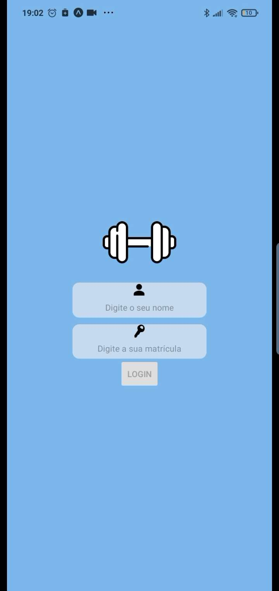
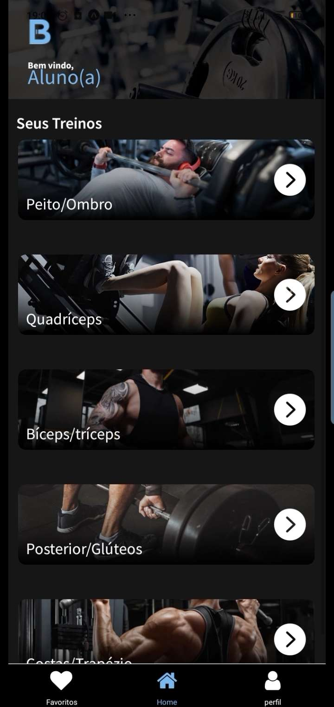
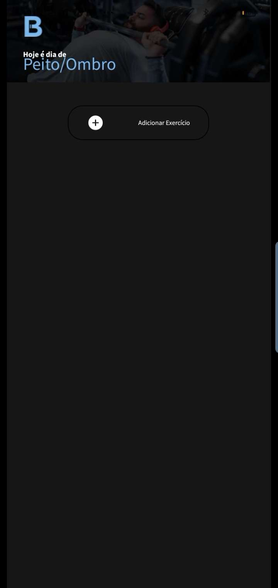

# Projeto - Aplicativo de musculação 0.1


Um aplicativo de musculação que oferecerá rotinas de exercícios, planos de treinamento e rastreamento de progresso para ajudar os usuários.

## Índice
- <a href="#funcionalidades">Funcionalidades do Projeto</a>
  - <a href="#layout">Layout</a>
  - <a href="#rodar">Como rodar este projeto?</a>
  - <a href="#tecnologias">Tecnologias Utilizadas</a>
  - <a href="#autor">Autor</a>
  - <a href="#passos">Próximos Passos</a>

  ## 📱Funcionalidades do Projeto
  
  - [ ] Login 
  - [x] NavBar
  - [ ] Edição dos Treinos
  - [ ] Página de Saúde

   ## 🖥️Layout
   
   
   
   
  ##  Como rodar este projeto?
  ```bash
  # Clone este repositório
  $ git clone linkrepo
  
  # Acesse a pasta no seu terminal
  $ cd (caminho)/gym-app
  
  # Instale as dependências
  $ npm install
  
  # Execute o aplicativo
  $ yarn start
  ```
  
  ## Tecnologias Utilizadas
  1. [React](https://reactnative.dev)
  2. [Yarn](https://classic.yarnpkg.com/en/docs/cli/run)
  3. [Node](https://nodejs.org/en)
  4. [Expo](https://docs.expo.dev/get-started/installation/)

 ## Autor
 - George José (Monteskieu)
 [Linkedin](https://www.linkedin.com) (Ainda vou colocar o link certo)
 
 ## Próximos passos
 
 - [ ] Editar Treinos
 - [ ] Login 
 - [ ] Cadastro
 - [ ] Perfil
